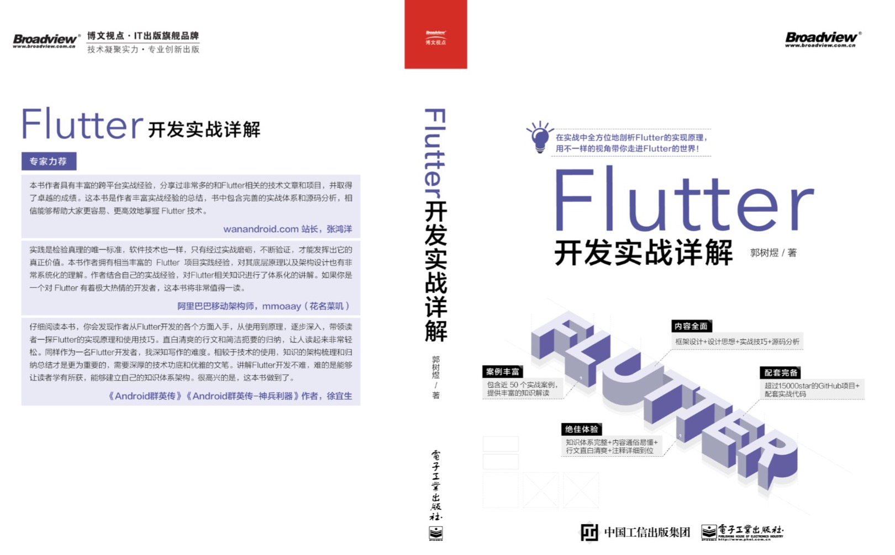

# 《Flutter开发实战详解》修订项目

#### 这个项目是用于修订补充《Flutter开发实战详解》中的一些笔误或者勘误，原纸质书可见：https://item.jd.com/12883054.html / 电子版[京东读书](https://e.jd.com/30624414.html)和[Kindle](https://www.amazon.cn/dp/B08BHQ4TKK/ref=sr_1_5?__mk_zh_CN=亚马逊网站&keywords=flutter&qid=1593498531&s=digital-text&sr=1-5)

### 如果图片资源看不到可以看 [码云](https://gitee.com/CarGuo/flutter_dev_book_revised)

## 修订内容

- 1、[第三章中 Widget 和 Element 对应关系内容修正](./revised_1/INDEX.md)
- 2、[第二章和第五章部分内容修正](./revised_2/INDEX.md)
- 3、[第五章部分内容更正](./revised_3/INDEX.md)
* 
* 
* 
* 

## 联系方式

