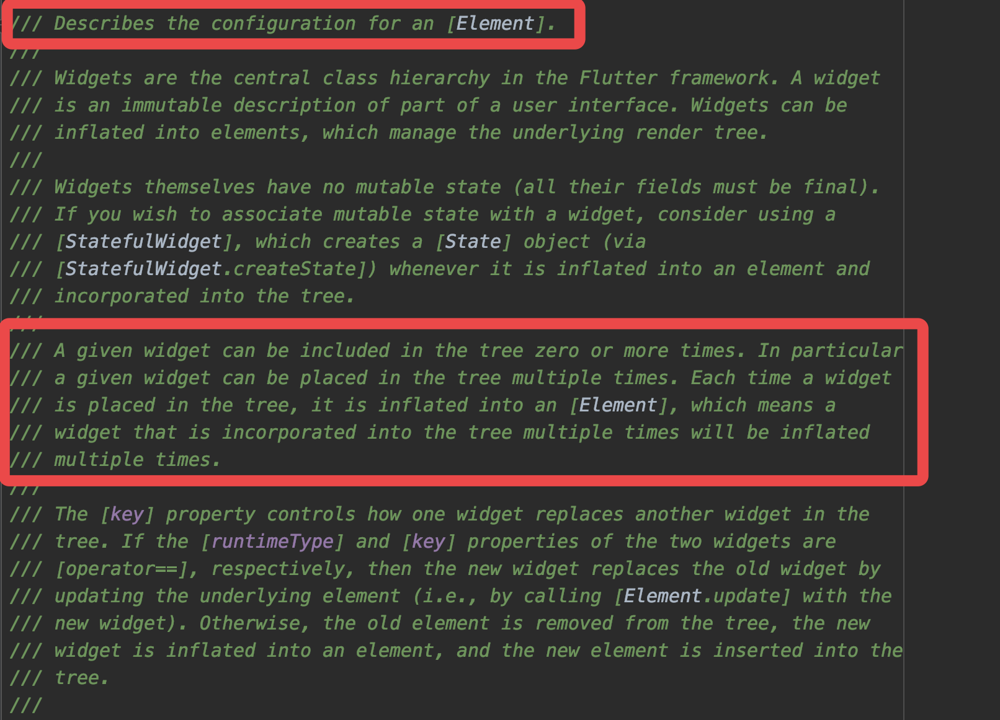

> 在 70 页说中之前秒速了 Widget 和 Element 是多对一的关系，但是在 88 页又说是一对多的关系

这里补充解释下，避免读者混乱：

在 70 页里因为一开始在解释 Widget 和 Element 的时候，是从实例的角度去做对比，因为 Widget 是不可变的，所以在 Widget 不断被更新的整个历史周期里，多个 Widget 实例在绘制过程会被用到一个 Element，所以是多对一的关系，这样也是比较好理解的。

而到 88 页的时候是把 Widget 定位成了配置文件的角度，一个已经存在的配置文件（Widget）被多个 Element 所引用。如下图所示，正如官方在注释里说，Widget 是 Element 的配置文件，Element 通过 Widget 去配置 RenderObject 实现更新绘制。

所以该角度 Widget 和 Element 是一对多的关系，因为真实工作的其实是 Element 树，而 Widget 作为配置文件，可能会在多个地方被复用，就如注释中的 ：

>  a given widget can be placed in the tree multiple times. Each time a widget is placed in the tree, it is inflated into an [Element]

所以造成该笔误的原因是前后角度出现变为，故此更正。
