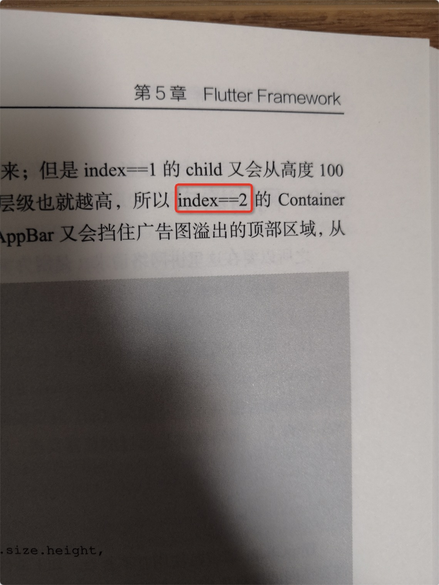

## 第二章本次订正内容


如上图所示，在 34 页的 Class A 对象内 super.a() 方法注释了，如下所示输出结果，按照书中所示的执行结果，这里的 super.a() 不能屏蔽，因为屏蔽后面的 B.a() 和 base a() 不会执行输出。


```
flutter: A2.a()
flutter: A.a()
flutter: B.a()
flutter: base a()
flutter: A.b()
flutter: B.b()
flutter: base b()
flutter: B.c()
flutter: base c()
```

但是此处的目的是为了对比 mixin 的行为结果，所以这里按照 Class A 对象内 super.a() 方法注释，那么输出结果应该是如下所示： B.a() 和 base a() 没有输出，故此处代码的输出结果应修改为如下所示：

```
flutter: A2.a()
flutter: A.a()
flutter: A.b()
flutter: B.b()
flutter: base b()
flutter: B.c()
flutter: base c()
```

后续解释应修改为

从最终输出结果可以看到：

- 在执行 g.a() 方法时，输出的是从入最右边的 A2.a() 开始的，之后才是 A.a() ，**而B.a()、base a() 没有被执行，因为  Class A 对象内 super.a() 方法注释；**
- 在执行 g.b() 方法时，因为 A2 没有 b() 方法存在，所以按照顺序只输出了 A.b()、B.b()、 base b()；
- 在执行 g.c() 方法时，因为 A2 和 A 都没有实现 c 方法，所以只输出了 B.c() 、base c()。


**另外需要额外补充说明，如果你在运行代码出现如下所示问题：**

```
error: The class 'A2' can't be used as a mixin because it extends a class other than Object. 
```

那么需要在你**项目根目录增加 analysis_options.yaml 文件，并添加如下所示内容后执行下 `flutter pub get`。**


```
analyzer:
  errors:
    mixin_inherits_from_not_object: ignore
    mixin_references_super: ignore
```

如果是低版本 dart analysis_options.yaml 需添加内容应增加为如下所示：

```
analyzer:
  language:
    enableSuperMixins: true
  errors:
    mixin_inherits_from_not_object: ignore
    mixin_references_super: ignore
```


## 第五章本次订正内容




如上图所示，在 187 页上这里的内容应该是 index == 1 ，也就是代码注释里写的第二个 Item，在这里订正。


